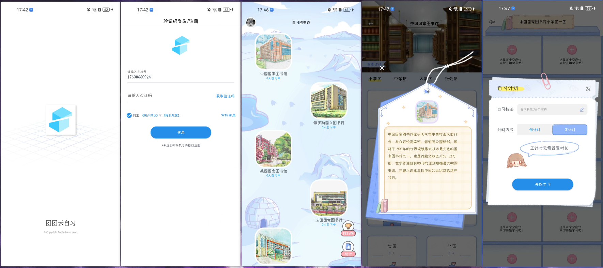
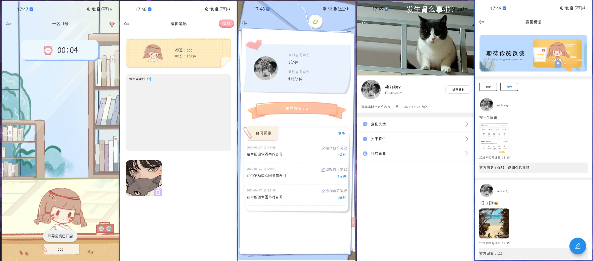

# TuanTuan Cloud Study - Android Client

**English | [中文](https://github.com/yang-jiacheng/StudyRoom/blob/master/README.zh-CN.md)**

<div align="center">
  
  <h3>Break Time and Space Limitations, Study Efficiently Anytime, Anywhere</h3>
  <p>Modern Online Study Room Android Application</p>
</div>

---

## 📖 Project Introduction

With the development of Internet technology and the popularization of mobile devices, traditional offline study rooms gradually expose their limitations in time and space. **TuanTuan Cloud Study** Android client provides students with a convenient mobile learning platform, allowing users to enjoy efficient learning experiences anywhere.

This project adopts **modern Android development technology stack**, uses **MVVM architecture** and **Jetpack components**, combined with **Material Design language**, to provide users with smooth and beautiful learning experience.

**Development Language:** Kotlin  
**Architecture Pattern:** MVVM + Repository  
**Learning Purpose:** This project is for technical learning and communication only

---

## 🚀 Core Features

#### 🚀 **Learning Management**
- **Smart Study Rooms**: Support creating/joining public study rooms with real-time display of online learners
- **Multiple Timing Modes**: Positive timing and countdown timing modes to meet different learning habits
- **Learning Records**: Automatically record study duration and note content, generate detailed learning reports
- **Seat Management**: Virtual seat allocation to create real study room atmosphere

#### 👥 **Social Interaction**
- **Learning Leaderboard**: Daily/weekly/monthly study duration rankings to motivate continuous learning
- **Learning Note Sharing**: Support text and image notes to promote knowledge exchange
- **User Feedback**: Complete feedback mechanism for continuous user experience optimization

#### 🔐 **Security Authentication**
- **JWT Authentication**: Mobile client uses JWT Token authentication, balancing security and convenience
- **Permission Management**: Role-based fine-grained permission control system
- **Data Security**: User data encrypted transmission and local secure storage

#### 📊 **Data Statistics**
- **Learning Statistics**: Personal study duration, focus level, and progress trend analysis
- **Data Visualization**: Charts showing learning achievements and growth trajectory
- **History Records**: Complete learning record query and management

---

## 🛠️ Technology Stack

**Development Language:** Kotlin

### Jetpack Components
- **ViewModel**: Manage UI-related data with lifecycle awareness
- **LiveData**: Observable data holder for reactive UI updates
- **DataStore**: Modern data storage solution replacing SharedPreferences
- **ViewBinding**: Type-safe view binding replacing findViewById

### Network & Data
- **Network Framework**: [Retrofit 2.9.0](https://square.github.io/retrofit/) - REST API client
- **Reactive Programming**: [RxJava2](https://github.com/ReactiveX/RxJava) - Asynchronous programming
- **Coroutine Support**: [Kotlin Coroutines](https://kotlinlang.org/docs/coroutines-overview.html) - Lightweight concurrency

### UI & Interaction
- **UI Design**: [Material Design Components](https://material.io/develop/android)
- **Image Loading**: [Glide 4.14.2](https://bumptech.github.io/glide/) - Image caching and display
- **Image Picker**: [PictureSelector](https://github.com/LuckSiege/PictureSelector) - Image/video picker

---

## 🏗️ Project Structure

```txt
StudyRoom 
├── app                                      // Android application module
│    └── src/main/java/com.lxy.studyroom
│         └── ui                             // UI layer - interface related
│              └── main                      // Main page module - library list, leaderboard
│              └── login                     // Login authentication module - user login registration
│              └── room                      // Study room module - study timing, record management
│              └── personalcenter            // Personal center module - user info, settings
│              └── feedback                  // Feedback module - user feedback suggestions
│         └── logic                          // Business layer - data processing
│              └── dto                       // Data transfer objects
│              └── model                     // Data entity models
│              └── network                   // Network request services
│              └── Repository.kt             // Unified data repository management
│         └── util                           // Utility layer - common utility classes
│         └── constant                       // Constant definitions
│         └── extension                      // Kotlin extension functions
│         └── widget                         // Custom UI components
│    └── src/main/res                        // Resource files
│         └── layout                         // Layout files
│         └── drawable                       // Icon resources
│         └── values                         // Strings, colors, styles
├── build.gradle                             // Project build configuration
```

## Preview




## ⚡ Quick Start

### Environment Requirements
- **Android Studio**: Arctic Fox (2020.3.1) or higher
- **JDK**: Version 8 or higher
- **Android SDK**: API 33 (Android 13)
- **Kotlin**: 1.8.0 or higher

### Configuration

#### Build Variants
```kotlin
productFlavors {
    prod {
        // Production environment configuration
        buildConfigField "String", "API_HOST", prod_host
        manifestPlaceholders = ["flavors": "TuanTuan Cloud Study"]
    }
    local {
        // Local development environment configuration
        buildConfigField "String", "API_HOST", local_host
        manifestPlaceholders = ["flavors": "TuanTuan Cloud Study-Local"]
    }
}
```

---

## Project Links

### 🔗 Related Repositories

- **🖥️ Server:** https://github.com/yang-jiacheng/selfstudy-server
- **🌐 Admin Backend:** https://github.com/yang-jiacheng/studyroom-admin-web  
- **📱 Android Client:** https://github.com/yang-jiacheng/StudyRoom

### 🏗️ Project Architecture

```
┌─────────────────────────────────────────────────────────────┐
│                    Cloud Study Ecosystem                     │
├─────────────────────────────────────────────────────────────┤
│  📱 Android App          🌐 Admin Web         🖥️ Backend    │
│  ┌─────────────────┐    ┌─────────────────┐    ┌─────────────────┐ │
│  │   User App      │    │   Admin Panel    │    │   API Server    │ │
│  │                │    │                │    │                │ │
│  │ • Study Room   │◄──►│ • User Mgmt     │◄──►│ • Spring Boot   │ │
│  │ • Study Record │    │ • Data Stats    │    │ • MySQL DB      │ │
│  │ • Personal     │    │ • System Config │    │ • Redis Cache   │ │
│  │ • Notifications│    │ • Access Control│    │ • OSS Storage   │ │
│  └─────────────────┘    └─────────────────┘    └─────────────────┘ │
└─────────────────────────────────────────────────────────────┘
```

## Demo

### 🌐 Online Experience

**Android Client Download：** [Click to download](https://selfstudy-server.oss-cn-hangzhou.aliyuncs.com/android/studyroom/apk/studyroom-1.0.6-7-0125.apk)

**Admin Backend：** http://115.29.185.30/studyRoomAdminWeb/#/

**Demo Account：**

`test123` / `123456`
> Note: The demo account only has query permission


### 📱 Feature Preview

You can try the following features during experience:

- ✅ User login and permission switching
- ✅ Dynamic menus and routing
- ✅ User management and role assignment  
- ✅ Study record query and statistics
- ✅ System configuration and parameter management
- ✅ OSS file upload and storage management
- ✅ Responsive layout adaptation

## Contact Me

### 👨‍💻 Author Information

**Yang Jiacheng** - Full Stack Developer

**Contact:**

- 📧 **Email:** yjc1529425632@gmail.com
- 💬 **WeChat:** crushed_whiskey
- 🐙 **GitHub:** https://github.com/yang-jiacheng

**About Author:**

- 💼 Focus on full-stack development and system architecture
- 🌟 Love open source projects and technology sharing
- 🎯 Committed to building elegant and efficient software systems

### 💡 Feedback & Suggestions

If you have any questions, suggestions or feedback, welcome to contact through:

1. **GitHub Issues** - Report bugs or feature requests
2. **Email Contact** - Technical exchange and cooperation
3. **WeChat Consultation** - Quick response and technical support

### License

StudyRoom is licensed under the Apache License, Version 2.0. See [LICENSE](https://github.com/yang-jiacheng/StudyRoom/blob/master/LICENSE) for the full license text.

---

<div align="center">
	<p><strong>⭐ If this project helps you, please give me a Star! ⭐</strong></p>
    <p><strong>📢 Welcome to share with more friends who need it! 📢</strong></p>
</div>
