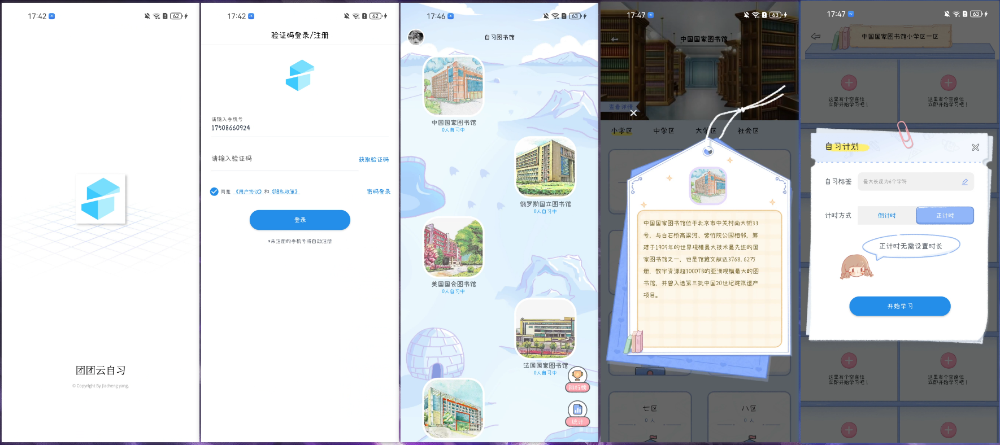
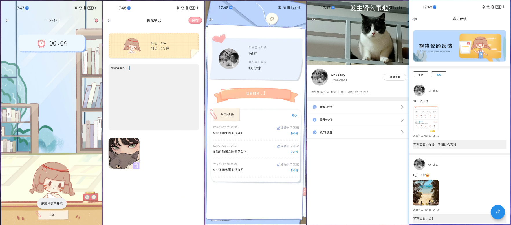

# 团团云自习 - Android客户端

**[English](https://github.com/yang-jiacheng/StudyRoom/blob/master/README.md) | 中文**

<div align="center">
  
  <h3>打破时空限制，随时随地高效学习</h3>
  <p>现代化的在线自习室Android应用</p>
</div>

---

## 📖 项目简介

随着互联网技术的发展和移动设备的普及，传统的线下自习室逐渐暴露出时间和空间的局限性。**团团云自习**Android客户端为广大学生提供了一个便捷的移动学习平台，让用户能够在任何地方享受高效的学习体验。

本项目采用**现代Android开发技术栈**，使用**MVVM架构**和**Jetpack组件**，结合**Material Design设计语言**，为用户提供流畅、美观的学习体验。

**开发语言：** Kotlin  
**架构模式：** MVVM + Repository  
**学习目的：** 本项目仅用于技术学习和交流

---

## 🚀 核心功能特性

#### 🚀 **学习管理**
- **智能学习室**: 支持创建/加入公共学习室，实时显示在线学习人数
- **多种计时模式**: 正计时和倒计时两种学习模式，满足不同学习习惯
- **学习记录**: 自动记录学习时长、笔记内容，生成详细的学习报告
- **座位管理**: 虚拟座位分配，营造真实自习室氛围

#### 👥 **社交互动**
- **学习排行榜**: 每日/周/月学习时长排行，激励持续学习
- **学习笔记分享**: 支持文字和图片笔记，促进知识交流
- **用户反馈**: 完善的反馈机制，持续优化用户体验

#### 🔐 **安全认证**
- **JWT认证**: 移动端使用JWT Token认证，平衡安全性和便利性
- **权限管理**: 基于角色的细粒度权限控制系统
- **数据安全**: 用户数据加密传输和本地安全存储

#### 📊 **数据统计**
- **学习统计**: 个人学习时长、专注度、进步趋势分析
- **数据可视化**: 图表展示学习成果和成长轨迹
- **历史记录**: 完整的学习记录查询和管理

---

## 🛠️ 技术栈

**开发语言：** Kotlin

### Jetpack 组件
- **ViewModel**: 管理UI相关数据，具备生命周期感知能力
- **LiveData**: 可观察的数据持有者，实现响应式UI更新
- **DataStore**: 现代化的数据存储解决方案，替代SharedPreferences
- **ViewBinding**: 类型安全的视图绑定，替代findViewById

### 网络与数据
- **网络框架**: [Retrofit 2.9.0](https://square.github.io/retrofit/) - REST API客户端
- **响应式编程**: [RxJava2](https://github.com/ReactiveX/RxJava) - 异步编程
- **协程支持**: [Kotlin Coroutines](https://kotlinlang.org/docs/coroutines-overview.html) - 轻量级并发

### UI与交互
- **UI设计**: [Material Design Components](https://material.io/develop/android)
- **图片加载**: [Glide 4.14.2](https://bumptech.github.io/glide/) - 图片缓存和显示
- **图片选择**: [PictureSelector](https://github.com/LuckSiege/PictureSelector) - 图片/视频选择器

---

## 🏗️ 项目结构

```txt
StudyRoom 
├── app                                      // Android应用模块
│    └── src/main/java/com.lxy.studyroom
│         └── ui                             // UI层 - 界面相关
│              └── main                      // 主页面模块 - 图书馆列表、排行榜
│              └── login                     // 登录认证模块 - 用户登录注册
│              └── room                      // 学习室模块 - 学习计时、记录管理
│              └── personalcenter            // 个人中心模块 - 用户信息、设置
│              └── feedback                  // 反馈模块 - 用户反馈建议
│         └── logic                          // 业务层 - 数据处理
│              └── dto                       // 数据传输对象
│              └── model                     // 数据实体模型
│              └── network                   // 网络请求服务
│              └── Repository.kt             // 数据仓库统一管理
│         └── util                           // 工具层 - 通用工具类
│         └── constant                       // 常量定义
│         └── extension                      // Kotlin扩展函数
│         └── widget                         // 自定义UI组件
│    └── src/main/res                        // 资源文件
│         └── layout                         // 布局文件
│         └── drawable                       // 图标资源
│         └── values                         // 字符串、颜色、样式
├── build.gradle                             // 项目构建配置
```


## 预览





## ⚡ 快速开始

### 环境要求
- **Android Studio**: Arctic Fox (2020.3.1) 或更高版本
- **JDK**: 版本 8 或更高
- **Android SDK**: API 33 (Android 13)
- **Kotlin**: 1.8.0 或更高版本

### 配置说明

#### Build Variants
```kotlin
productFlavors {
    prod {
        // 生产环境配置
        buildConfigField "String", "API_HOST", prod_host
        manifestPlaceholders = ["flavors": "团团云自习"]
    }
    local {
        // 本地开发环境配置
        buildConfigField "String", "API_HOST", local_host
        manifestPlaceholders = ["flavors": "团团云自习-本地"]
    }
}
```

---

## 项目地址

### 🔗 相关仓库

- **🖥️ 服务端:** https://github.com/yang-jiacheng/selfstudy-server
- **🌐 后台管理系统:** https://github.com/yang-jiacheng/studyroom-admin-web  
- **📱 Android 客户端:** https://github.com/yang-jiacheng/StudyRoom

### 🏗️ 项目架构图

```
┌─────────────────────────────────────────────────────────────┐
│                         云自习生态系统                        │
├─────────────────────────────────────────────────────────────┤
│  📱 Android App          🌐 Admin Web         🖥️ Backend    │
│  ┌─────────────────┐    ┌─────────────────┐    ┌─────────────────┐ │
│  │   用户端应用     │    │   管理后台       │    │   API服务器      │ │
│  │                │    │                │    │                │ │
│  │ • 自习室预约    │◄──►│ • 用户管理       │◄──►│ • Spring Boot   │ │
│  │ • 学习记录      │    │ • 数据统计       │    │ • MySQL数据库   │ │
│  │ • 个人中心      │    │ • 系统配置       │    │ • Redis缓存     │ │
│  │ • 消息通知      │    │ • 权限控制       │    │ • OSS存储       │ │
│  └─────────────────┘    └─────────────────┘    └─────────────────┘ │
└─────────────────────────────────────────────────────────────┘
```

## 演示地址

### 🌐 在线体验

**后台管理系统：** http://115.29.185.30/studyRoomAdminWeb/#/

**演示账号：**

- 管理员：`yjc123` / `123456`
- 其他角色：`xiuyu123` / `123456`

**Android 客户端下载：** https://selfstudy-server.oss-cn-hangzhou.aliyuncs.com/android/studyroom/apk/studyroom-1.0.6-7-0125.apk

**移动端演示账号：** `17508660924` / `123456`

> ⚠️ **注意：** 由于阿里云SMS短信服务限制，个人开发者无法申请短信签名，请使用密码登录方式

### 📱 功能预览

体验时可以尝试以下功能：

- ✅ 用户登录与权限切换
- ✅ 动态菜单和路由
- ✅ 用户管理和角色分配  
- ✅ 学习记录查询和统计
- ✅ 系统配置和参数管理
- ✅ OSS文件上传和存储管理
- ✅ 响应式布局适配


## 联系我

### 👨‍💻 作者信息

**杨嘉诚** - 全栈开发工程师

**联系方式：**

- 📧 **邮箱：** yjc1529425632@gmail.com
- 💬 **微信：** crushed_whiskey
- 🐙 **GitHub：** https://github.com/yang-jiacheng

**关于作者：**

- 💼 专注于全栈开发和系统架构
- 🌟 热爱开源项目和技术分享
- 🎯 致力于构建优雅高效的软件系统

### 💡 反馈与建议

如果您有任何问题、建议或反馈，欢迎通过以下方式联系：

1. **GitHub Issues** - 报告Bug或功能请求
2. **邮件联系** - 技术交流和合作
3. **微信咨询** - 快速响应和技术支持

### License

StudyRoom 是根据Apache许可证2.0版获得许可的。有关完整的许可证文本，请参阅[LICENSE](https://github.com/yang-jiacheng/StudyRoom/blob/master/LICENSE)

---

<div align="center">
	<p><strong>⭐ 如果这个项目对您有帮助，请给我一个Star！⭐</strong></p>
    <p><strong>📢 欢迎分享给更多需要的朋友！📢</strong></p>
</div>

